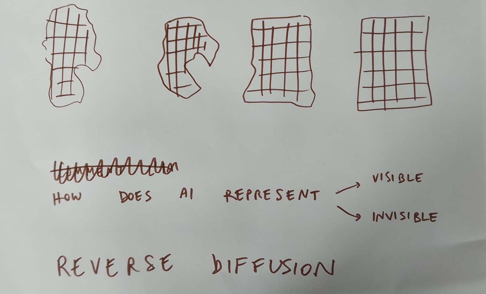
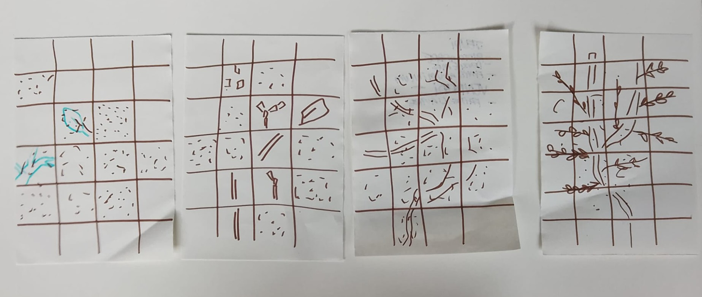
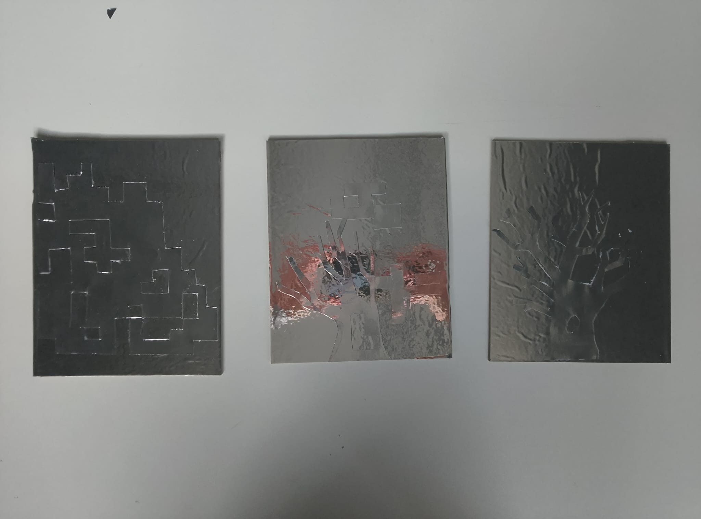
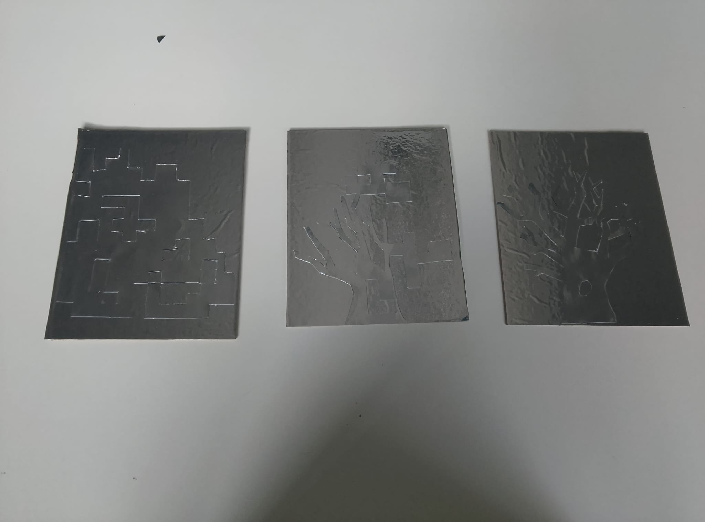

## Semaine de tous les possibles, HEAD, Geneva. SUN SHINES BRIGHT : THINKING ABOUT AI AND DESIGN IN CLIMATE CRISES

### Teacher: COMPUTATIONAL MAMA

### Test our project [HERE](https://egazzarr.github.io/head-md-AI-representation/)!


### OUR PROJECT: HOW DOES AI *REPRESENT* THINGS?

We start from the reflection that while a human can make mistakes, and she can be forgiven for them, we are much more scared about AI making mistakes, as the AI entity is something that we expect to be perfect. Many people trust it without questioning it. AI becomes the religion of the modern age. It is not human, it cannot feel things, and we wonder how its world of representations might look like. As all humans have slightly different representations of the world 'tree' based on experience, it is interesting to notice that this representation is an accumulation of all images, but it does not usually take a precise, defined form in our brain. It is the platonic world of ideas, maybe innate, maybe coming from experience. Now, what does the representation of a concept look like for an AI? It is just the most probable outcome, a merging of billions of images of trees, coming out of an immense noise background. During the workshop, we investigated how to represent the inverse diffusion process of image generation by embodying it in physical form through some silver plated paper cuttings, going from noise pixels to a tree, and in digital form with a simple p5.js webpage through which the public is able to discover what is behind the image generation process, by using many pictures of trees taken by us during the week. 

| | |
|---|---|
|  |  |
|  |  |

Inspiration: https://arxiv.org/pdf/2203.05922

We explored image generation with local Stable Diffusion models and local voice cloning to represent how we come to consider AI as an extension of ourselves. 


Github voice clone: https://github.com/shamspias/vibevoice-studio
to clone voice with AI running locally, clone this repo and type in your terminal: 

```
cd vibevoice-studio
source venv/bin/activate$
python -m app.main
```
### PROJECT BRIEF (GENERAL)

As designers, we are often burdened with the responsibility of enacting change. But how can we move forward with ideas and action if we do not fully understand the technologies we work with? How can we bring back hope to our design processes?
This workshop invites participants to learn, understand, and address how artificial intelligence (AI) and large language models (LLMs) shape our work and practice as designers. Together, we will deepen our understanding of collective efforts, build resilience and hope, and focus our energies on building an inclusive future.

Over the course of the week, participants will explore:

- The infrastructures and impacts behind the AI we use every day

- Why AI and LLMs are important to future designers

- How conversational user experience (UX) will shape our design practices in the years to come

- How we can begin to create these infrastructures ourselves

- Why understanding technology — and its embedded criticalities — is a vital skill for designers today

By the end of this workshop, participants will:

- Create critical, feminist AI bots and interfaces (digital or physical)

- Build a mini data center inside the classroom

- Build prototypes of renewable energy systems

This workshop is open to all students who care about a collective future of design. No technical skills are required — just a willingness to learn new things, roll up one’s sleeves, and build something together. All parts of the workshop will be group activities.